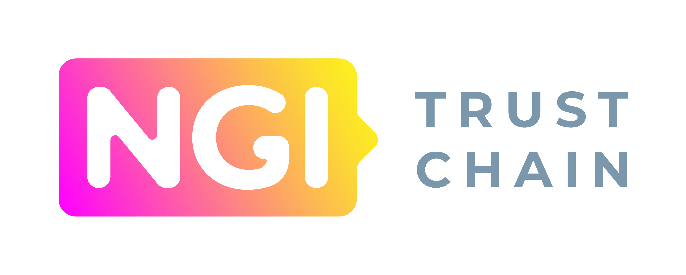

  

### Multi-platform, multi-functional Identity/SSI wallet

---

DIDroom is an open-source multiplatform and multifunctional Identity DID/SSI wallet.
DIDroom will also have advanced cryptographic and blockchain functions, including signatures, multi-signatures and blockchain interoperability (for Ethereum, Hyperledger Fabric and Sawtooth, and Planetmint) via Oracles.
  

### 🚩 Table of Contents

- [🎯 Intro and Goals](#-intro-and-goals)
- [💡 The solution](#-solution)
- [🚀 Deployment](#-deployment)
- [✋ Constraints](#-constraints)
- [🔍 Scope and context](#-scope-and-context)
- [📐 Architectural overview](#-architectural-overview)
- [🏗️ Building blocks](#%EF%B8%8F-building-blocks)
- [🖼️ Scenarios](#%EF%B8%8F-scenarios)
- [📑 Glossary](#-glossary)
- [🚑 Community & support](#-community--support)
- [😍 Acknowledgements](#-acknowledgements)
- [👤 Contributing](#-contributing)
- [💼 License](#-license)

  

## 🎯 Intro and Goals

DIDroom is an open-source multiplatform and multifunctional Identity DID/SSI wallet.
DIDroom will also have advanced cryptographic and blockchain functions, including signatures, multi-signatures and blockchain interoperability (for Ethereum, Hyperledger Fabric and Sawtooth, and Planetmint) via Oracles.

### Design goals

**`Secure`** Protect information and data so that persons or other products have only access to an extend appropriate to their types and levels, and to defend against attack patterns by malicious actors

**`Usable`** Enable users to perform their tasks safely, effectively and efficiently while enjoying the experience

**`Operable`** Easy to deploy, operate, monitor and control

**`Reliable`** Perform specified functions under specified conditions without interruptions or failures

### User stories and functional requirements

The user stories in form of text are avaialble [here](https://github.com/forkbombEu/signroom/issues?q=is%3Aissue+is%3Aopen+label%3A%22%F0%9F%92%86%E2%80%8D%E2%99%80%EF%B8%8F+User+story%22+sort%3Acreated-asc) they are live and in progress.

In the meantime the user journey are also under development available on [here](https://www.figma.com/file/Z2z4uAFbQY8lnv06bK017z/DidRoom---User-stories?type=whiteboard&node-id=0%3A1&t=dp0BQVHrNWaO47KK-1) to give an example of the outcomes: 

**[🔝 back to top](#toc)**

***

## 💡 The Solution
Our solution is divided into different repositories, each focusing on a specific component. This modular approach allows us to maintain flexibility and scalability, enabling users to customize and integrate the solution according to their specific needs and requirements.

### DIDroom Control Room (Dashboard)
The DIDroom Control Room/Dashboard serves as the central hub for managing decentralized identity solutions. It provides a user-friendly interface for configuring settings, monitoring performance, and accessing key functionalities.
   
The core features of the Control Room are: 
 - Creation of credential issuance and verification flows
 - Deployment and provisioning of the DIDroom Microservices
 - Creation of organizations, assigning of privileges to different users
 - The admin panel of the Control Room offers:
    - User management
	- Setup of web-hooks and automation flows
	- Customization of the Control Room menu entries

> [!TIP]
> [GitHub](https://github.com/forkbombeu/signroom)
>
> Deployment on [dashboard.didroom.com](https://dashboard.didroom.com)

### DIDroom Mobile libs (Mobile Zencode)
   A collection of mobile library, *Zencode Mobile* holds all the business logic and contracts shared between the different components of the DIDroom Solution. It serves as a centralized repository for managing and updating the core business logic used across various mobile applications and components.

> [!TIP]
> [GitHub](https://github.com/forkbombeu/mobile_zencode)

### DIDroom microservices
   Those are the technological core of the solution: those components offer cryptographic functions as well as transport protocols. The microservices are completely isolated from the Dashboard, meaning that: 
   - The code is hosted in a separated repo
   - The microservices can run independently from the Dashboard
   - Each microservice has its own secret keys and DID to identify them: those are generated by the microservice at its first provisioning

   DIDroom microservices are generated using No-code-room (NCR) and utilize the Zencode Mobile repository to create three different microservices:
   - **Credential Issuers**: These microservices are compliant with Openid4VCI standards and handle the issuance of credentials.
   - **Authorization Servers**: These microservices implement OAuth2 and work seamlessly with our DID Service for authentication and authorization.
   - **Relying Party**: These microservices are compliant with Openid4VP standards and act as relying parties for authentication and authorization.

> [!TIP]
> [GitHub](https://github.com/forkbombeu/DIDroom_microservices)

### Wallet Holder App
   The Wallet Holder App offers a secure and user-friendly interface for managing decentralized identities and digital credentials. It allows users to store, view, and share their identity information with ease inside a TEE (Trusted execution environment) directly on citizens devices.

> [!TIP]
> [GitHub](https://github.com/forkbombeu/wallet)
>
> [Latest relase](https://github.com/ForkbombEu/wallet/releases/latest/download/wallet.apk)

### Verifier App
   The Verifier App provides tools for verifying the authenticity and validity of decentralized identities and digital credentials. It enables organizations to validate identity claims and ensure compliance with regulatory requirements.

> [!TIP]
> [GitHub](https://github.com/forkbombeu/verifier)
>
> [Latest relase](https://github.com/ForkbombEu/verifier/releases/latest/download/wallet.apk)

### DIDroom web components
   DIDroom Web Components hold all the UI web components used across all the projects to ensure a coherent Atomic design and allow for white-labeling.

> [!TIP]
> [Storybook](https://forkbombeu.github.io/didroom-components/)
>
> [GitHub](https://github.com/forkbombeu/DIDroom-components)

**[🔝 back to top](#toc)**

***

## 🚀 Deployment

### Deployment from sourcecode

Please follow the "On premise deployment" documentation on our site: [https://forkbombeu.github.io/DIDroom/guides/sysadmin/](https://forkbombeu.github.io/DIDroom/guides/sysadmin/):

 

### Containerization with Docker

The deployment strategy for the DidRoom system involves utilizing containerization technology and an on-premise approach, facilitated by Docker. This strategy aims to provide scalability, flexibility, and consistent environments across different stages of deployment.

Containers are employed to encapsulate the DidRoom application and its dependencies, ensuring consistent behavior across various environments, from development to production. Docker, a widely-used containerization platform, is employed to create, deploy, and manage containers. This approach enhances deployment efficiency and simplifies environment setup.

Key Aspects of Containerization:
  - `Isolation`: Each component of the DidRoom system, including services and middleware, is encapsulated within separate containers, maintaining isolation and preventing interference between components.
  - `Portability`: Docker containers encapsulate the entire runtime environment, ensuring the application operates consistently regardless of the hosting environment.
  - `Scalability`: The containerized architecture allows for horizontal scaling, enabling the system to accommodate varying levels of workload.

### On-Premise Deployment

The deployment of DidRoom is executed on-premise, which means the system is hosted and managed within the organization's infrastructure. This approach offers control over data privacy, security, and customization, including the concept of "white label" deployment.

Benefits of On-Premise Deployment:

  - `Data Control`: Sensitivity to data privacy and security requirements can be met by maintaining control over data within the organization's environment.
  - `Customization`: The deployment environment can be tailored to meet specific organizational needs, configurations, and even offer white-label deployment for branding purposes.
  - `Performance`: On-premise deployment often offers lower latency and improved performance, particularly for critical and real-time applications.

The combination of containerization using Docker and on-premise deployment ensures a reliable and efficient deployment strategy for DidRoom, enabling seamless management and scalability while adhering to security, branding, and customization requirements.

**[🔝 back to top](#toc)**

***

## ✋ Constraints

### Regulatory Constraints
 - DidRoom's architecture is subject to the eIDAS 2.0 regulation, ensuring alignment with the latest identity and electronic signature standards within the European Union.
 - The architecture adheres to "The European Digital Identity Wallet Architecture and Reference Framework" (EUDI-ARF, version 1.0.0), a pivotal component of the eIDAS 2.0 regulation.

### Technical Constraints
 - DIDroom is required to support the W3C-DID and W3C-VC standards to ensure compatibility with identity and verifiable credential systems.
 - The cryptographic capabilities of Zenroom will be utilized for various functions, including signatures, hashes, multisignatures, and zero-knowledge proofs.
 - The architecture must support a federated 4-levels W3C-DID method with multiple storage mechanisms, such as filesystems, databases, blockchains, Git, and IPFS.
 - The architecture must accommodate the blockchain interoperability requirements for Ethereum, Hyperledger Fabric, Sawtooth, and Planetmint.

### Organizational Constraints
 - The architecture leverages open-source components developed by the Dyne.org Foundation
 - DIDroom is based on components of the Zenroom ecosystem, including the cryptographic virtual machine "Zenroom" and Dyne.org's W3C-DID implementation.

### Integration Constraints
- Zenswarm, a blockchain oracle technology, will be used for blockchain interoperability and off-chain cryptography. It features a built-in off-chain consensus algorithm and is developed using Zenroom at its core.
- Signroom, a web-based service, will be integrated to enable users to sign documents and objects using W3C-DID identities.

### Compatibility and Security Constraints
- DidRoom must be compatible with modern smartphones and the latest mobile operating systems.
- The wallet's operation must be secure on the client side, ensuring data privacy and protection. All cryptographic operations and sensitive data handling should occur within the secure environment of the user's device.

**[🔝 back to top](#toc)**

***
## 🔍 Scope and context

**`DidRoom User`**: An external actor who engages with the DidRoom system to manage and control their decentralized identifiers (DIDs) and self-sovereign identity (SSI) credentials. The DidRoom user interacts with the system to create, update, and manage their digital identity attributes, as well as to generate and control verifiable credentials.

The DidRoom user is and individual seeking to leverage decentralized identity technologies for secure and verifiable digital interactions. They interact with the DidRoom system to manage their identity-related data and utilize the cryptographic and blockchain capabilities provided by the system.

**`DidRoom Service Provider`** An external actor that utilizes the DidRoom platform to create and deliver services to users. The service provider engages with the DidRoom system to establish secure data contracts with their users, ensuring the authenticity, integrity, and privacy of user data. The service provider may include individuals, organizations, or entities that offer services that require secure identity and data interactions.

Key Characteristics:
- `Service Creation`: The service provider utilizes the DidRoom system to create services that require identity and data verification. These services may involve user interactions, transactions, verifiable claims, or any other form of secure digital activity.
- `Data Contracts`: The service provider establishes data contracts with their users, outlining the mandatory and optional attributes for the use of the service and the handling of user data. These contracts are secured through the cryptographic capabilities of the DidRoom system.
- `Verifiable Claims`: The service provider leverages the verifiable credentials and cryptographic features of the DidRoom system to issue and verify claims about users. These verifiable claims can be used to attest to the authenticity of user attributes or transactions.
- `Secure Interactions`: The service provider is ensured that interactions with users occur in a secure and privacy-preserving manner. The DidRoom system enables secure communication, data sharing, and verification of user identity and claims.
- `Integration with Blockchain Networks`: If required, the service provider can integrate their services with external blockchain networks (such as Ethereum, Hyperledger Fabric, Sawtooth, Planetmint) through the DidRoom system, by using the zenswarm oracles interoperability capabilities.

**[🔝 back to top](#toc)**

***
## 📐 Architectural overview

DidRoom's architecture is designed to achieve the following design goals:

### Secure
DidRoom is engineered to protect information and data to ensure access is limited appropriately based on user types and levels. It is designed to thwart attack patterns initiated by malicious actors. The use of Zenroom's cryptographic capabilities and secure communication protocols contributes to data protection.

### Usable
Usability is a primary concern of DidRoom's architecture. The system is designed to enable users to perform tasks safely, effectively, and efficiently. The user interface is carefully crafted to enhance the user experience while adhering to security principles. Signroom, the web-based service, ensures that cryptographic operations are user-friendly and accessible.

### Operable
Operability is ensured by designing DidRoom to be easy to deploy, operate, monitor, and control. The architecture employs established deployment patterns and clear operational interfaces. The integration of Zenswarm as a blockchain oracle solution contributes to the system's ability to seamlessly interact with different blockchains. Also the dashboard will allow to provision new oracle nodes and easily access to information like auditing logs.

### Reliable
DidRoom is engineered to reliably perform specified functions under defined conditions without interruptions or failures. The architecture is designed with fault tolerance and redundancy in mind. The use of Dyne.org's W3C-DID implementation with its built-in explorer enhances the reliability of identity-related operations.

**[🔝 back to top](#toc)**

***
## 🏗️ Building blocks

DIDroom is based on a stack of open-source components and middlewares implemented by the Dyne.org Foundation during several H2020 and EC-funded research projects. The relevant components of the Zenroom ecosystem are:

 - [dyne/zenroom](https://github.com/dyne/zenroom) **The cryptographic virtual machine “Zenroom”** 
   
   a multi-platform virtual machine for cryptography (signatures, hashes, multisignature, zero knowledge proof, quantum proof cryptography) blockchain interoperability (Ethereum, Hyperledger Fabric and Sawtooth, Bitcoin, Planetmint), that supports W3C-DID and W3C.VC natively

 - [dyne/W3C-DID](https://github.com/dyne/W3C-DID) **Dyne.org’s W3C-DID implementation**

   a federated 4-levels W3C-DID method, supporting multiple storage mechanisms (filesystem, databases, blockchains, Git, IPFS) with a builtin explorer.  
   
  |  resource|URI|
  |-----|-----|
  | intro | https://forkbomb.solutions/products/w3c-did |
  | specification  | https://dyne.github.io/W3C-DID |
  | DID explorer | https://explorer.did.dyne.org |

 - [dyne/zenswarm](https://github.com/dyne/zenswarm) **Zenswarm: blockchain oracle technology**
    built for blockchain interoperability and offchain cryptography, with a built-in off-chain consensus algorithm, using Zenroom at its core and developed within the EBSI PCP. More info at https://forkbomb.eu/products/zenswarm

 - [forkbombeu/signroom](https://github.com/forkbombeu/signroom) **Signroom: Advanced electronic signature service**
   Open source, modular, easy to extend, web-based service, leveraging Zenroom’s cryptographic capabilities, allowing users sign documents and objects, using W3C-DID identities.

**[🔝 back to top](#toc)**

***

## 🖼️ Scenarios

### User stories [link](https://github.com/forkbombEu/signroom/issues?q=is%3Aissue+is%3Aopen+label%3A%22%F0%9F%92%86%E2%80%8D%E2%99%80%EF%B8%8F+User+story%22+sort%3Acreated-asc) 

### User journeys WIP [link](https://www.figma.com/file/Z2z4uAFbQY8lnv06bK017z/DidRoom---User-stories?type=whiteboard&node-id=0%3A1&t=dp0BQVHrNWaO47KK-1)

**[🔝 back to top](#toc)**

*** 

## 📑 Glossary

**Blockchain Networks**: Refers to distributed and decentralized networks that utilize blockchain technology for secure and transparent record-keeping. Examples include Ethereum, Hyperledger Fabric, Sawtooth, and Planetmint.

**Blockchain Oracles**: Services or technologies that enable smart contracts or decentralized applications (DApps) to interact with external data sources, APIs, or events from the real world. Blockchain oracles provide the means for blockchain systems to obtain off-chain information and make informed decisions.

**Decentralized Identifier (DID)**: A globally unique, self-sovereign identifier that enables individuals and entities to have control over their digital identities without relying on centralized authorities.

**EUDI-ARF**: Acronym for "The European Digital Identity Wallet Architecture and Reference Framework," a technical core of the eIDAS 2.0 regulation that outlines standards for digital identity wallets.

**eIDAS 2.0 Regulation**: The updated version of the eIDAS (electronic Identification, Authentication and Trust Services) regulation that sets standards for electronic identification and trusted services within the European Union.

**Self-Sovereign Identity (SSI)**: A decentralized identity model that enables individuals to have full control over their digital identity and personal data. SSI allows users to manage and share verifiable credentials without the need for intermediaries.

**Verifiable Credentials (VC)**: Digital attestations that enable the issuance and verification of claims about a subject's identity, attributes, or qualifications.

**Wallet**: In the context of DidRoom, a software application or platform that allows users to manage their digital identities, store cryptographic keys, create and manage DIDs, and interact with blockchain networks and verifiable credentials.

**Zero-Knowledge Proofs**: Cryptographic methods that allow a party to prove knowledge of a certain value or statement without revealing the actual value itself. Zero-knowledge proofs enhance privacy and security by demonstrating knowledge without disclosing sensitive information.

**W3C-DID**: Abbreviation for "W3C Decentralized Identifier," a standard by the World Wide Web Consortium (W3C) for creating, managing, and resolving decentralized identifiers.

**W3C-VC**: Abbreviation for "W3C Verifiable Credentials," a standard by the World Wide Web Consortium (W3C) for creating and verifying digital credentials in a secure and interoperable manner.

**Zenroom**: A cryptographic virtual machine developed by Dyne.org Foundation, capable of performing various cryptographic operations and supporting blockchain interoperability.

**Zenswarm**: A blockchain oracle technology developed for blockchain interoperability and off-chain cryptography, utilizing Zenroom at its core.

**[🔝 back to top](#toc)**

***
## 🚑 Community & support

**[📝 Documentation](#toc)** - Getting started and more.

**[🌱 Ecosystem](https://forkbomb.solutions)** - Resources, and more.

**[🚩 Issues](https://github.com/forkbombeu/signroom/issues)** - Bugs end errors you encounter using DIDroom.

**[📖 Example](https://github.com/NGI-TRUSTCHAIN/DidRoom/example)** - [TBD].

**[🔝 back to top](#toc)**

***
## 😍 Acknowledgements

Copyleft 🄯 2023 by [The Forkbomb Company](https://www.forkbomb.solutions), Amsterdam

This documentation is loosely based on the [arc42 template](https://arc42.org/overview)

The diagrams follows the [C4 model](https://c4model.com/)

Diagrams are generate with [C4-Plantuml](https://github.com/plantuml-stdlib/C4-PlantUML) and PlantUML

Diagrams are served via [kroki](https://kroki.io/)

Some definitions are borrowed from [ISO/IEC TS 25052-1](https://www.iso.org/obp/ui/#iso:std:iso-iec:25010:dis:ed-2:v1:en): 2022(en) Systems and software engineering — Systems and software Quality Requirements and Evaluation

Some definitions comes also from L. Bass, P. Clements, and R. Kazman, Software architecture in practice, 4th ed. Addison-Wesley Professional, 2021.

Supported by [NGI TRUSTCHAIN](https://trustchain.ngi.eu/), which is made possible with financial support from the European Commission's [Next Generation Internet](https://ngi.eu/) programme.

**[🔝 back to top](#toc)**

***
## 👤 Contributing

Please first take a look at the [The Forkbomb Company - Contributor License Agreement](CONTRIBUTING.md) then

1.  🔀 [FORK IT](../../fork)
2.  Create your feature branch `git checkout -b feature/branch`
3.  Commit your changes `git commit -am 'feat: New feature\ncloses #398'`
4.  Push to the branch `git push origin feature/branch`
5.  Create a new Pull Request `gh pr create -f`
6.  🙏 Thank you

**[🔝 back to top](#toc)**

***
## 💼 License
    DIDroom - Multi-platform, multi-functional Identity/SSI wallet
    Copyleft 🄯 2023 The Forkbomb Company, Amsterdam

    This program is free software: you can redistribute it and/or modify
    it under the terms of the GNU Affero General Public License as
    published by the Free Software Foundation, either version 3 of the
    License, or (at your option) any later version.

    This program is distributed in the hope that it will be useful,
    but WITHOUT ANY WARRANTY; without even the implied warranty of
    MERCHANTABILITY or FITNESS FOR A PARTICULAR PURPOSE.  See the
    GNU Affero General Public License for more details.

    You should have received a copy of the GNU Affero General Public License
    along with this program.  If not, see <http://www.gnu.org/licenses/>.

**[🔝 back to top](#toc)**
