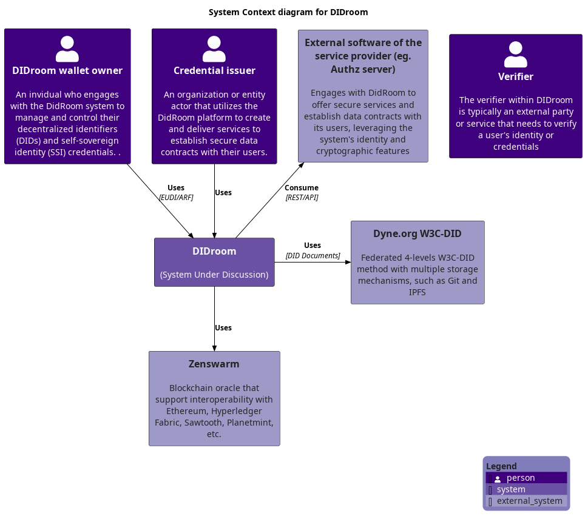

# Diagrams

Follow loosely the C4 diagram modeling standards.

## 🚀 Getting started

1. Generate locally by running

```bash
java -jar plantuml.jar -DRELATIVE_INCLUDE="." *.puml
```
2. Remote hosted via kroki

head your browser to [kroki](https://kroki.io) use the `c4plantuml` language and copy paste the source code to get a valid diagram url

## System Context diagram for DIDroom

