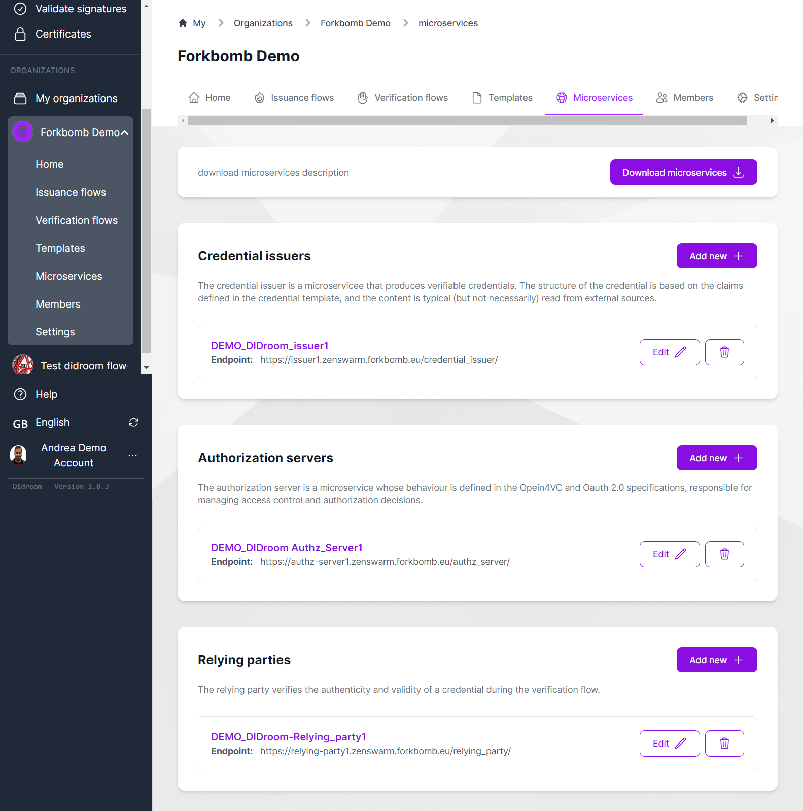

# Deploy microservices

#### for 🛠️ System Administrator

[DIDroom Microservices](/solution#didroom-microservices) are the technological core of the solution: those components offer cryptographic functions as well as transport protocols. The microservices are completely isolated from the Dashboard, meaning that:

- The code is hosted in a separated repo
- The microservices can run independently from the Dashboard
- Each microservice has its own secret keys and DID to identify them: those are generated by the microservice at its first provisioning
- The _Credential Issuer_ and _Authorization Server_ microservices, contain the custom code you defined in the respective templates

## Preparation

1. Register a domain name, like _myapp.com_ and ideally register 3 subdomains as: 
   - _issuer.myapp.com_
   - _authz.myapp.com_
   - _rp.myapp.com_

1. Setup a linux server, configure TLS and make sure the server is resolved at: https://myapp.com/ or ideally to the 3 subdomains as above. You'll need to setup a reverse proxy (more about it later).

1. Make sure you have all the commands installed, type: 

```bash
  sudo apt install make wget jq git -y
```

## Provision and download the Microservices

- Go to https://dashboard.didroom.com and create at least an Issuance Flow. During the creation, you will have to create multiple objects, such as templates and setup microservices. 
- Then From the *Microservices* page, click on "Download microservices"
- The Microservices page should look like this:



## Download and deploy the Microservices

1. Copy the microservices.zip file on the server and unzip it, it should create multiple folders, one for each microservice you configured and used in the dashboard. Assuming that you have 3 microservices named _my-issuer_, _my-authz_, _my-rp_ then do:

1. type: 

```bash
cd  my-issuer
make up
```

And **repeat this** for each of the 3 microservices.
The _make up_ command generates the secret keys for the microservices, and registers a DID for each of them

From that moment, you should have the microservices (authz_server, credential_issuer and relying_party) configured and running, on the port you have configured in the dashboard.

# Reverse proxy (with Caddy)

The OpenID4VCI and OpenID4VP protocols dictate the use of TLS, so you'll need to be able to access each microservice via _https://_ 

There are multiple ways to do this, using e.g. Nginx. We recommend using [Caddy](https://caddyserver.com/) at least in test environments as it's easy and fast to configure. 

> [!IMPORTANT] Important:
> While you configure and test Caddy, the microservices must all be running already, at the correct ports, because Caddy will try to bind the ports when it's started (or reloaded). So **make sure you have the microservices running** before you go into this section.


#### Install Caddy
To install _Caddy_ check the [documentation](https://caddyserver.com/docs/install) or try your luck with: 

```bash
sudo apt update
sudo apt install caddy
```

#### Caddy config file

To edit Caddy config file, do : 

```bash
sudo nano /etc/caddy/Caddyfile
```


### Setup Caddy with 3 subdomains

If you have 3 subdomains, assuming that the microservices are running on the ports 3001, 3002 and 3003, add to *Caddyfile*:

```caddy

issuer.myapp.com {
        reverse_proxy http://localhost:3001
}
authz.myapp.com {
        reverse_proxy http://localhost:3002
}
rp.myapp.com {
        reverse_proxy http://localhost:3003
}
```

### Setup Caddy with 1 domain

If you only have configured 1 domain, for example _myapp.com_ then add to *Caddyfile*

```caddy
myapp.com
 {
	reverse_proxy /credential_issuer/* :3001
	reverse_proxy /authz_server/* :3002
	reverse_proxy /relying_party/* :3003
} 
```

> [!IMPORTANT] Note:
> Using a single domain for all the microservices, with this configuration, won't allow you to use the [Swagger](https://swagger.io/) to test the microservices. The Swagger is available at the _/docs_ route, configuring it's access is possible but more complicated. 


<!--
### Alternative Way: Clone and Compile (for experts only)

This method is recommended for advanced users who prefer to have full control over their installation process and **over the requirements of OpenID4VCI**. Follow these steps:

1. **Clone Repository**: Clone the DiDRoom Microservices repository from our GitHub page.

2. **Compile .well-known and Credential Issuance Info**: Compile your .well-known file and credential issuance information according to your specific needs and requirements.

3. **Customize and Configure**: Customize and configure the microservices as needed for your applications. Ensure all components are correctly configured and integrated.

4. **Deployment**: Deploy the microservices in your environment and start managing decentralized identities and secure communication.

<<< @/.installation_instructions/didroom-microservices-installer.sh

You should see something like this

<video controls="controls" src="/.installation_instructions/didroom-microservices.mp4" />

Choose the installation method that best suits your preferences and requirements, and enjoy the benefits of DiDRoom Microservices!
--> 


## Receive your first credential

After you have deployed your microservice, you are ready to receive your first verifiable credential!

- install the wallet on an android phone from here: https://github.com/ForkbombEu/wallet (you can scan the QR code on the github repo),
- create a user on the wallet (or log in with the user you created on dashboard.didroom.com)
- scan the QR code you see in the Issuance Flow page (alternatively, if you log in using the dashboard user, you should see your credential in the Home of the wallet)
- If everything worked well, you should see something like this in the wallet:


