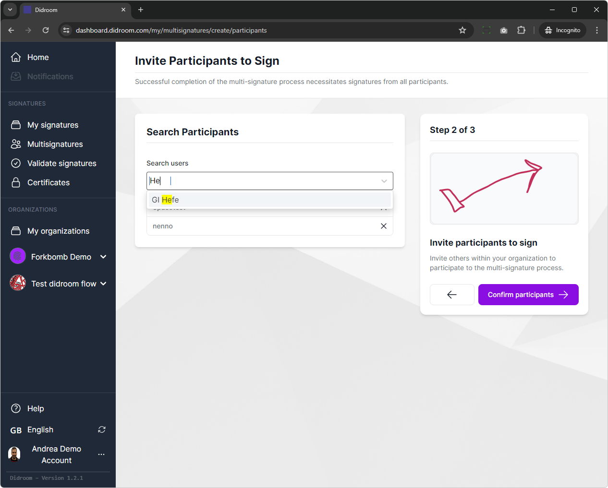

# Multisignature Flow

The Multisignature Flow is a an implementation of the cryptographic flow described in the [Reflow Multisignature](https://arxiv.org/abs/2105.14527) paper. This allows users to create a JSON object to be signed, invite users to sign it, set a deadline and wait for their signatures. The signature process uses the homomorphic capabilities of the BLS 12-381 curve - see [here](https://hackmd.io/@benjaminion/bls12-381) if you're curious. The responses are anonymous and the output is a cryptographical object verifiable by anyone.

## Create a Multisignature

Click on **Multisignatures** in the sidebar to get started: 

The first page is a brieg introducton giving some basic concepts. See below what a *Coconut Issuer* is and what it's used for. 

Click on **Start Setup** to get started, here you'll have to fill: 

- **Name**: the name of this Multisignature flow, the name will appear in your Multisignature page and those you invite as well.
- **Credential Issuer**: (Coconut Issuer) this is treated in a subchapter below. For now, just select the Coconut issuer we offer from the list
- **Reflow Seal**: this is the data that you're asking to sign (see the subchapter below). In this Reflow Seal, we have 3 individuals (*Spacetest*, *nenno* and *GI Hefe*) agreeing on their respective yearly designated driver quota.   
- **Settings**: here you can specify the expiry of the Multisignature, meaning that the invitees will only be allowed to sign until the deadline

The setup page looks like: 

### The *Reflow Seal* and the signing/verification algorithm

A **Reflow Seal** (as in the paper) is the data that the signees have to agree to sign. In our first implementation it's a JSON object and it can easily refer to a document, the content of a URL or something stored in a database or blockchain. 

In fact, that is an oversimplifycation of what a Reflow Seal is, a slightly more encompassing explaination is: the Reflow Seal is a cryptographic object containing the JSON above, along with the public keys and the signatures (if they choose to sign) of the signees. 

If you're not satisfied with this and are ready to deep-dive into the magic world of cryptography, read the text box below. 

> [!IMPORTANT] Warning: hard-core cryptography ahead 🤯
> In the cryptographic flow happening under the hood after the setup, The Reflow Seal is hashed, then each signee (that chooses to sign) will produce a [BLS 12-381 signature](https://www.ietf.org/archive/id/draft-irtf-cfrg-bls-signature-04.txt) that will be [homomorphically aggregated](https://eprint.iacr.org/2018/483) to the hash of the Reflow Seal. We did in fact omit an important step: while the Reflow Seal was being hashed, the public keys of the signees have been *homomorphically aggregated*. 

> After all the signatures have been collected and aggregated, a *Miller Loop* ( read a somewhat easy explanation [here](https://crypto.stackexchange.com/questions/61930/simple-explanation-of-millers-algorithm)) is performed to **verify if the aggregated signatures match the aggregated public keys**: if they do, the Multisignature is successful. This is the core of the algorithm, which enables anonymous signatures and was originally designed for blockchain applications. We did actually omit one more step, the Coconut credential issuance, which we cover below. 

### The Coconut Issuer

The [Coconut Paper](https://arxiv.org/abs/1802.07344) defines a zero knowledge proof flow for credential issuance, with plenty of bells and whistles. In our implementation, the Coconut Issuer produces a *Coconut credential* for each of the users invited to sing. 

> [!IMPORTANT] Warning: more hard-core cryptography ahead 🤯🤯
> Using a Coconut credential has the purpose of  making sure that the ones signing the Reflow Seal, are the ones who have been invited to sign, in order to overcoming the [rogue public key attack](https://eprint.iacr.org/2021/377.pdf) while keeping the signature anonymous and cryptographically verifiable.

## Invite the users 

When done with the steps above, click on **Confirm Content** on the top right of the page to land on the **Invite Users** page, that you can use to invite users base on their username or email (if they chose to have the email as public).

We chose to invite the users *Spacetest*, *nenno* and *GI Hefe* which are the people who will be sharing the car, according to the Reflow Seal. 

**Note**: The choice to include the signees' names in the Reflow Seal was aimed exclusively for educational purposes: you can write whatever you want in the Reflow Seal and invite whoever you want to sign it. 

The result should be something like this: 

## Finalize

This page shows you a recap of the Multisignature flow you're working on: at this stage you can still change things, once you click on *Confirm and Sign* in the top right of the page, the cryptographic material will be produced and you won't be able to make changes after that. 

## Wait for signatures

After you clicked on *Confirm and Sign*, the Multisignature is ready to be signed and a **notification is sent per email to the signees**. You'll see it here: 

## Check status

If you click on "View" on the Multisignature, you can see the status, including if everyone has signed or someone is missing.

