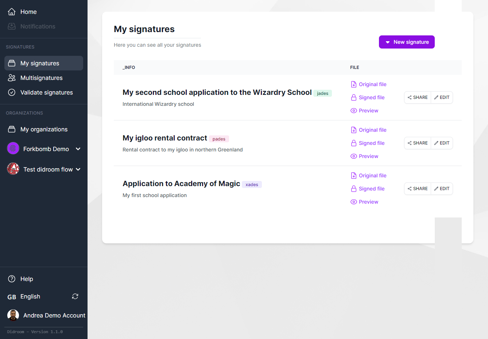
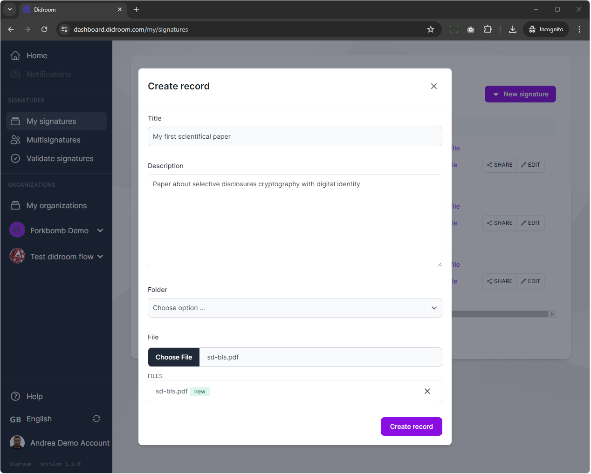
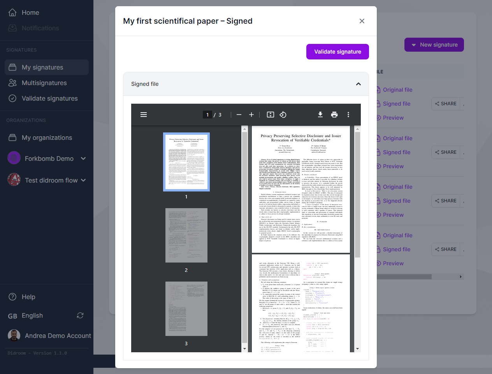
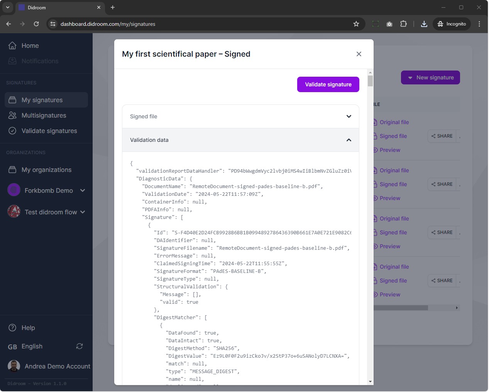
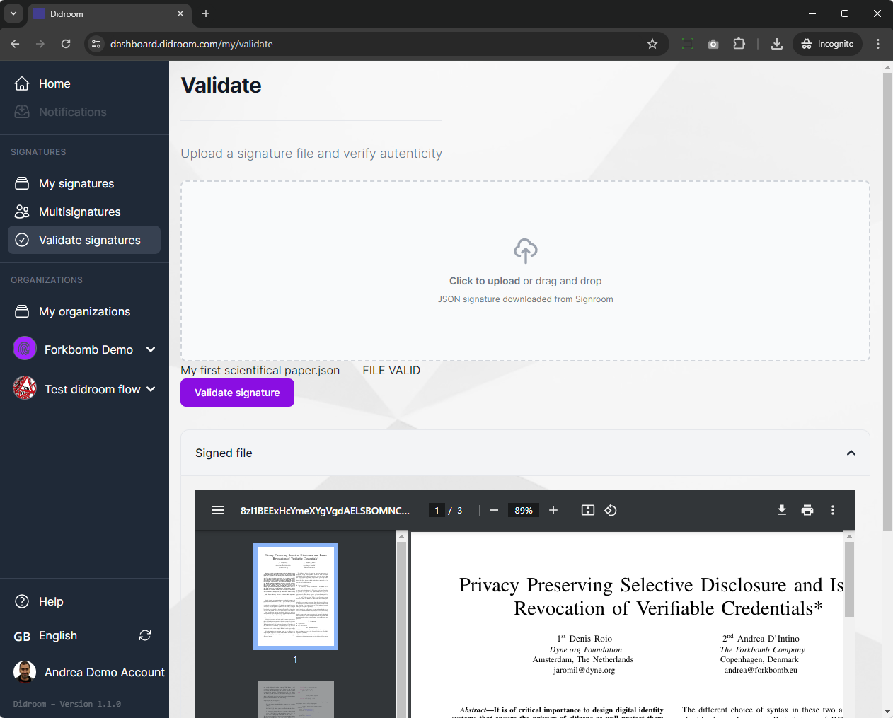

# Intro  

The Signature features allow to you sign documents and files, according to the standards *PaDES, CaDES, JaDES or XaDES* using your secrets keys and a certificate. 

You can as well verify signatures from 3rd parties. 

## Supported types 

The standard supported (PaDES/CaDES/JaDES/XaDES) are compliant with the [eIDAS regulation](https://en.wikipedia.org/wiki/EIDAS) and are the ones most widely accepted in the industry. 

## Signature flow 

The signature occurs in the Webapp, specifically **in the browser**: this implies that your secret keys are only used locally and never  communicated to anyone, according to the *privacy-by-design* and *end-to-encryption principles*. 

The signature produced in the Webapp is packed into a JSON object and communicated to a service we run in backend using the open source [Digital Signing Service](https://ec.europa.eu/digital-building-blocks/DSS/webapp-demo/doc/dss-documentation.html) software, the official software implemented and maintained by the European Commission, for digital signatures. The software is open source, you can find the source code on [https://github.com/esig/dss/](https://github.com/esig/dss/).

> [!IMPORTANT] Important!
> The secret key to sign documents is used only in the browser (thus the signature works offline!), are never communicated to anyone and from the signature it's mathematically impossible to recreate the secret key. 

# Sign document 

1) Click on the *New Signature* button on the top right and select what format of signature you would like to have (PaDES/CaDES/JaDES/XaDES)

2) Fill the *Title*, the *Description* optionally and upload a PDF.

3) If the signature succeded

# Verify signature

