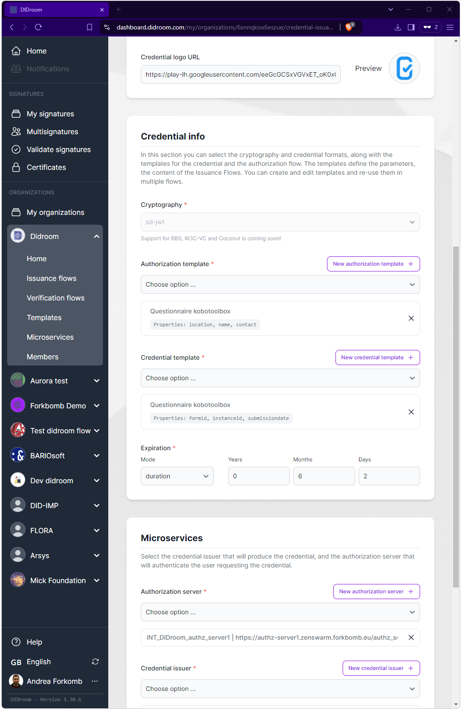

Flows define the full behaviour of credential issuance and verification. While the Template define the Flow's core business logic, you define in the Flow parameters such as the duration of a credential, the cryptography and protocols to be used, the Microservices it should run on, as well as the data that is visible by the user (name, description, logo) as well as the machine-readable data used in the communication protocols (e.g. OpenID4VCI and OpenID4VP).

- **TLDR: what is actually Flow in DIDroom?**
  > [!NOTE] 
  >  Imagine a Flow as a shell of extra parameters that surround a template. Imagine that you are offering the same credentials, once with a 1 day expiration and once with a 1 month expiration: the templates used will typically be the same, while the Flow configurations will change.

## Parameters

When editing the a Flow, you're editing several parameters, some of them are machine-readable, some are human readable, some have impact on the credentials that will be issued (*Cryptography* type and *Expiration*), some impact the deployment (the *Microservices* section).

| Dashboard Flow Editor  |  
|--|
|  |  

