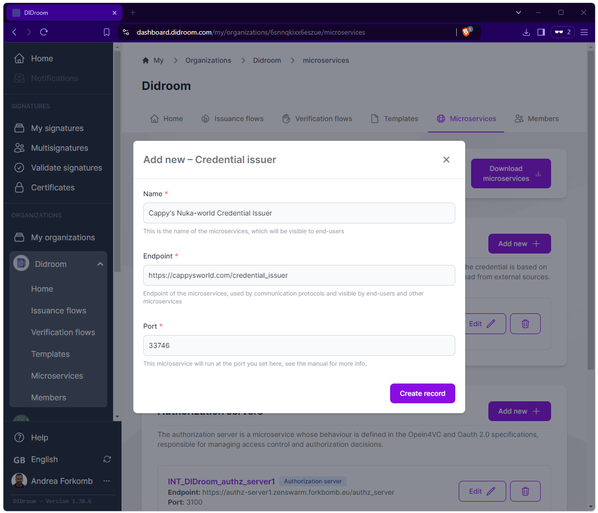
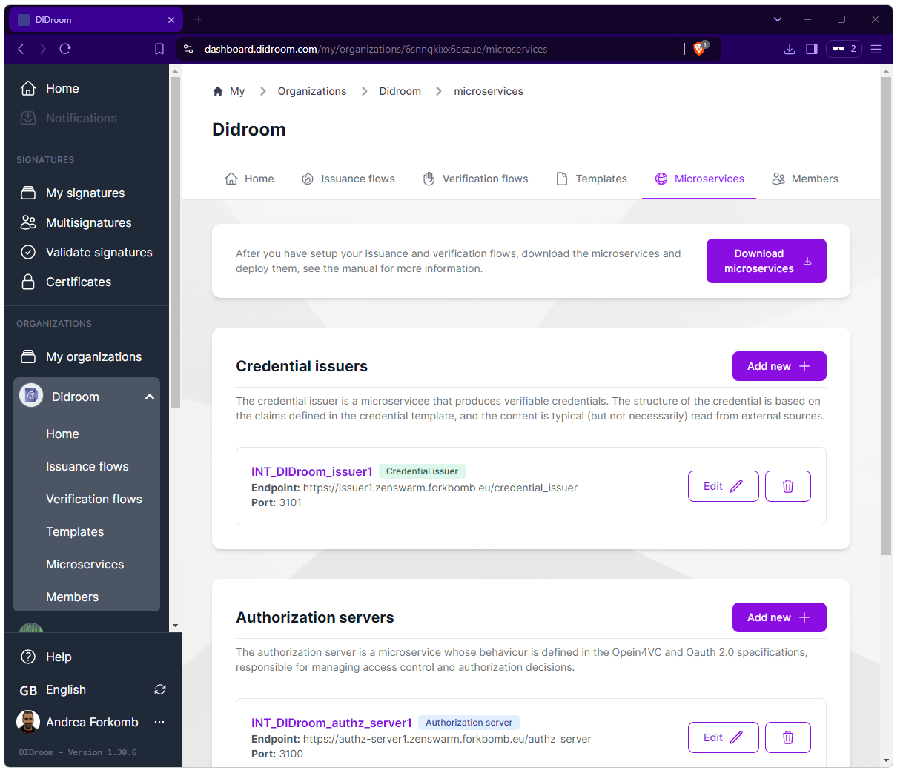

Credential Issuance and Verification are (partly) executed in Microservices. The Microservices are configured in the Dashboard, the Dashboard also provides you with the actuall Microservices code, with different deployment possibilities.  


## Configuration

You can create a new Microservice or edit it, by giving it a *Name* and an *Endpoint*, the *Port* is initially selected randomly but can be edited. 

| Microservices setup  |  
|--|
|  |  

## Deployment

Once you are happy with the Templated and Flows you created, you can start deploying them. You that by: 

1. Downloading the provisioned Microservices by pressing the *Dowload microservices* button. 
1. Upload the download .zip to the server where the Microservices will deployed, which responds to the Endpoint you previously configured.
1. Use the docker-compose file (typically doing 

```bash
docker-compose up
```

----

See below the *Home > Organization > Microservices* page:


| Microservices list and Deployment  |  
|--|
|  |  


## Extendability

DIDroom Microservices are implemented and deployed using: 


- NCR (no-code room):  REST API server for Zencode scripts, single binary, doesn't require su privildges, includes OpenAPI and automagic GUI for REST APIs  see 

	-> Repo: https://github.com/ForkbombEu/ncr

- DIDroom Microservices: OpenID4VCI and OpenID4VP compatible Microservices, highly customizable, implemented in Zencode (with some JS). This is where the server-side of new protocols and new cryptography is implemented. 

 	-> Repo: https://github.com/ForkbombEu/DIDroom_microservices

- Ghisa: minimalist 0-security proxy, saves you from (some) CORS errors. 

	-> Repo: https://github.com/ForkbombEu/ghisa


- Zenroom: Cryptographic virtual machine, powers all (almost) the cryptogrphy in DIDroom. Ultra portable, runs on server/mobile/browser/IoT. 

	-> Repo: https://dev.zenroom.org/
	
- Slangroom: Extension to Zenroom, for networking, database, file management. See: 

	-> Repo: https://dyne.org/slangroom/ 
	

