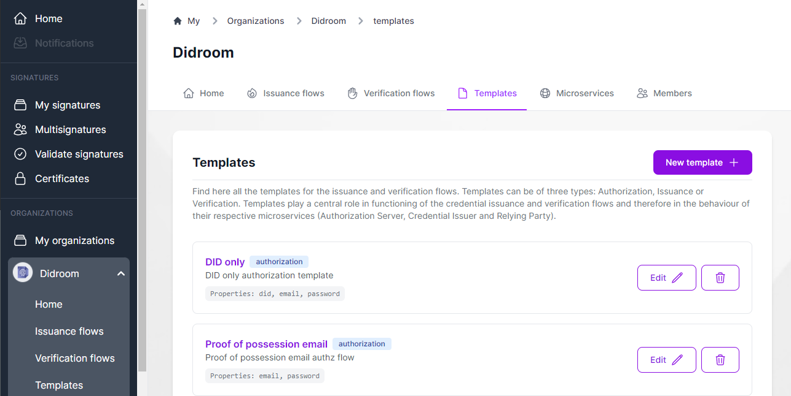

Here we describe the Templates: here lives the customizable and re-usable business logic of Credential Issuance and verification

## Intro

- **What is a template?**
  > [!IMPORTANT] 
  >  Templates contain (re-usable) business logic for issuance and verification flow. Templates are scripted in *Zencode* executed by Zenroom and Slangroom, check the [🏗️ Core Technologies](/core-technologies) to know more.
  
- **Where and how do I use a template?**

  Templates are used in *issuance Flows* and *Verification Flows*. When editing a flow, you can select the desired template from a dropdown.

- **How do edit a template?**
  Inside the Template editor, in the DIDroom Dashboard. If you want to test the code, you may want to use the [Slangroom editor](https://dyne.org/slangroom/) or [Apiroom](https://apiroom.net/).

- **Where are templates executed?**
  Depending if it's an *Authorization*, *Issuance* or *Verification*, the templates are executed inside a Microservice, inside the Wallet or inside the Verifier App [more about this later].
  

## Authorization, Issuance and Verification Templates

There are 3 types of Template, they are visible in *Organization > Home* and in the *Templates* section.  

| Templates in *Organization > Home*  |  
|--|
|  |  

| *Templates* section  |  
|--|
|  |  

## Parameters and presets

Based on the type, each Template has a different set of Parameters. Templates are typically built from **Presets**.

### Form structure  

It define here the Parameters that Flow (using this Template) will receive as input, specifically, 
 
 -> **Authorization Template**: the parameters in the form will be input by the user in the Wallet app and processed by the *Authorization Server*. 

 -> **Issuance Template**: this time the parameters in the form will be passed by the *Authorization Server* and processed by the *Credential Issuer*.
 
  -> **Verification Template**: the parameters in the form will be read inside the *Verifiable Presentation* produced by the *Wallet App* and processed by the *Verifier App*.

### Custom Code 

This contains the core logic of the Template. The Custom code can: 

 - Read and process the input coming from the parameters in the "Form structure"
 - Read and process parameters in the "Zencode data" 
 - Create and process data on the fly
 - Return the processed data: some types of Template, have a certain return data format (e.g. Authorization Template must return a JSON object named "data") but each template can send the output to a REST API or write it into a Database. The parameters relevant to REST APIs and Parameters must be loaded from "Zencode data" (see Presets for examples). 

| Template Editor  |  
|--|
|  |  

## Toolchain

Templates are programmed in Zencode and Slangroom and can be tested in the Slangroom Editor, see: https://dyne.org/slangroom/ 
	
| Slangroom Editor  |  
|--|
|  |  

