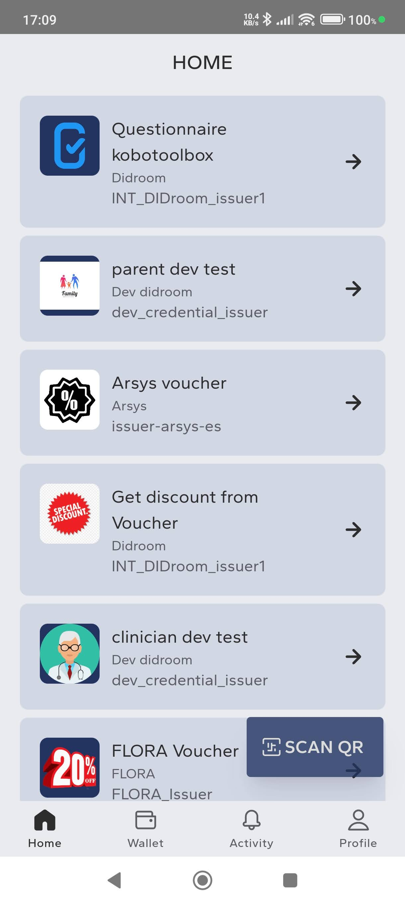
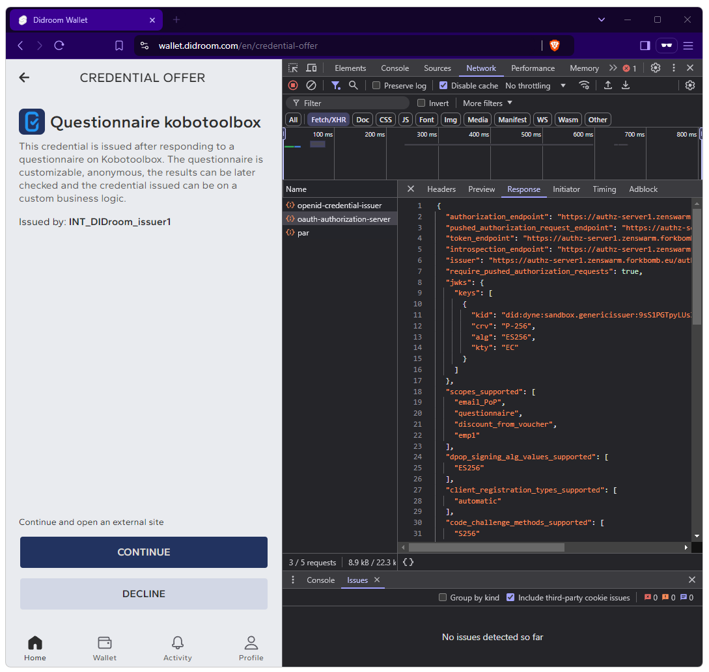
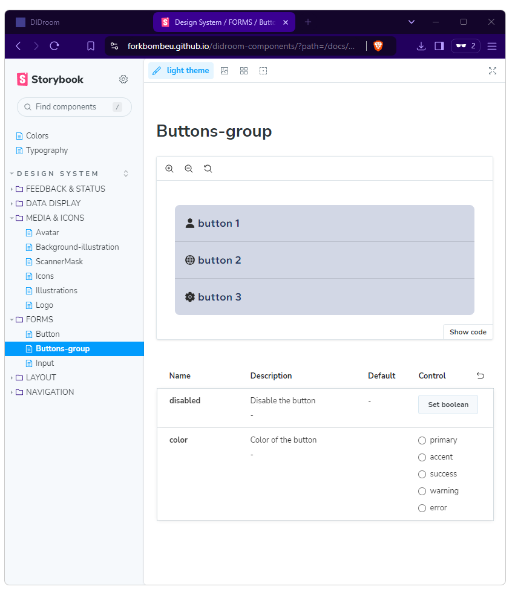

# 🆔 Wallet App 

The [Wallet App](https://github.com/ForkbombEu/wallet) is an Android/iOS mobile app whose purpose is to **request** and **present credentials**. 

The Wallet App allows the user to creat an account and the same account can be used to login onto the [DIDroom Dashboard](https://dashboard.didroom.com/).

| Wallet App screenshot  |  
|--|
|  |  

## Install the app

The app can be installed from the Android and iOS stores:

|  | |         |  
|--|--|--|
| | |  |
| | |  |

## Features
Once you login, you can: 
 - Select a credential to request, from the list you can see in the Wallet's home. The credentials that you see listed here, depend on what organization(s) your part of. 
 - Scan a QR code to receive a credential 
 - Scan a QR code (from the Verifier App) to present a credential.

## Test on the web

The Wallet can also be deployed as a web application, offering most of the app functionalities and ideal for testing and debugging. You can deploy your own instance by following the  [instructions](https://github.com/ForkbombEu/wallet?tab=readme-ov-file#installation) or test our (manually updated) web deployment at [wallet.didroom.com](https://wallet.didroom.com/).

| Wallet App deployed on web  |  
|--|
|  |  

## White-labeling

The Wallet (and Verifier) App are built with white-labeling in mind>

1. The mobile apps take load ALL the UX from [didroom-copmponents](https://github.com/forkbombeu/didroom-components) which is packaged into [NPM 
package](https://www.npmjs.com/package/@didroom/components) via CI. 
1. The whole deployment of the mobile apps on the Android/iOS stores is done via CI,see for example the Android production deployment [CI script](https://github.com/ForkbombEu/wallet/actions/workflows/publish_on_production.yml).
1. See below DIDroom-components [Storybook](https://forkbombeu.github.io/didroom-components/?path=/docs/colors--docs). 

|  | 
|--|
| | 